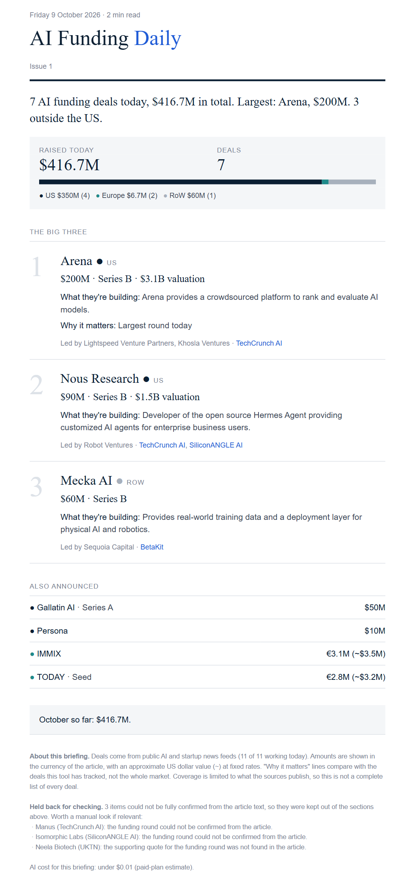
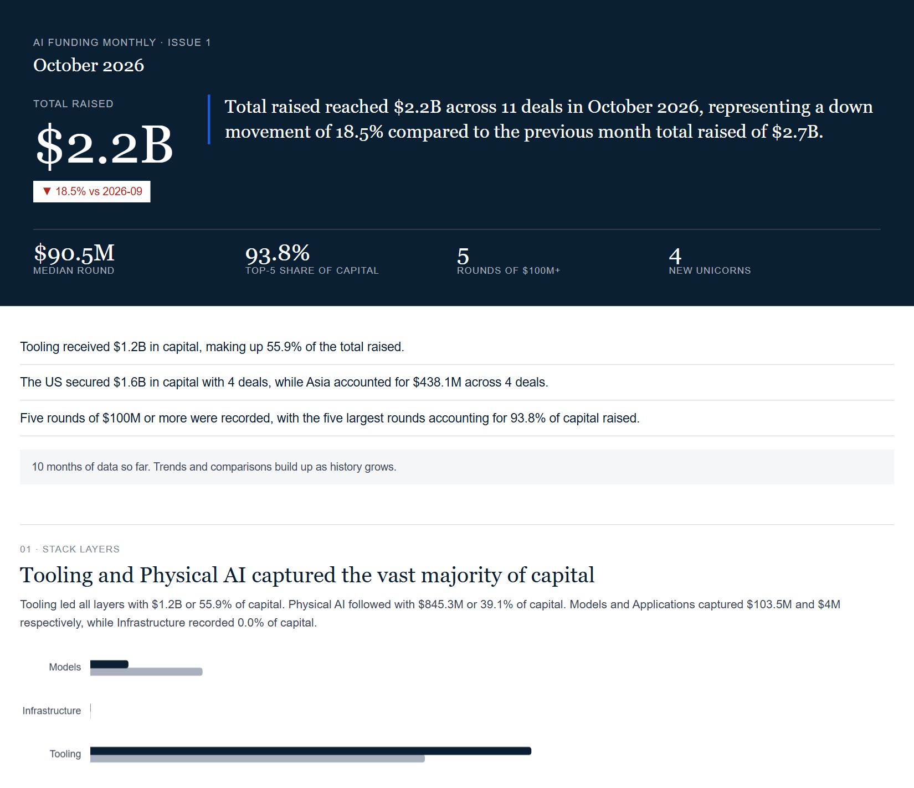
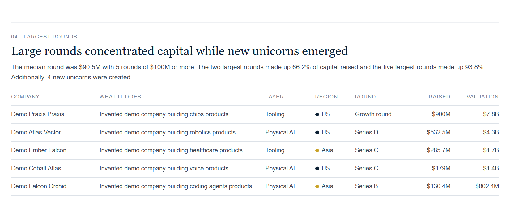

# AI Funding Daily and Monthly

**Purpose: see where capital and funding in AI is going.** Which kinds of AI companies raise money, in which regions, at which stage, from which investors, and how that shifts month to month.

The agent reads public AI and startup news from around the world, picks out the funding announcements, checks the facts, stores them in one clean database of deals, and emails you:

- **AI Funding Daily**: a short morning briefing (the three biggest deals, the rest in one line each, plus bad news such as shutdowns and down rounds).
- **AI Funding Monthly**: at month end, a chart-led report (HTML and PDF) with commentary: where the money went by layer of the AI stack, by region, by funding stage, the largest rounds, and every deal of the month.

## What it looks like

**Daily email** (example from a real run on 9 October 2026, built from live news feeds):



**Monthly report** (built from invented "Demo ..." companies, so the numbers mean nothing):





## Disclaimers

- **Public sources only.** Everything comes from publicly available news feeds. Nothing is bought, scraped behind a login or taken from private data.
- **Automated, no human review.** An AI model reads the articles and code checks the result. Nobody reads the emails before they are sent. Deals, amounts, rounds, valuations and company descriptions can be wrong, incomplete or out of date.
- **Not complete.** It only sees what the sources below publish, in English. It is a sample of the market, not a full list of every deal. "Why it matters" lines compare a deal with the deals this tool has tracked, not the whole market.
- **Approximate dollar values.** Amounts in other currencies are converted at fixed approximate rates (`config/fx_rates.yaml`).
- **Not investment, legal or financial advice.** Check anything important against the original article (every deal links to its sources).
- **Independent project.** It is not affiliated with, or endorsed by, any news source, investor or company it mentions.

## Where the news comes from

News is tracked globally across four regions. Each source is a public RSS feed (a standard "latest articles" list that sites publish for exactly this purpose). The tier (1 = most established outlet) gives a small ranking boost to deals reported by higher-tier sources, and the best-tier source is listed first.

| Region | Sources (tier) |
|---|---|
| US | TechCrunch AI (1), Crunchbase News (1), SiliconANGLE AI (2) |
| Europe | Sifted (1), EU-Startups (2), UKTN (2) |
| Asia | e27 (2, South-East Asia), Inc42 (2, India), YourStory (3, India) |
| Rest of world | BetaKit (2, Canada), Wamda (2, Middle East and North Africa) |

This is the starting list, not a limit. You can add more in `config/sources.yaml`. Honest gaps: Asia is covered through South-East Asia and India only (no China, Japan or Korea feed), and there is nothing dedicated to Latin America or Africa. Tech.eu is switched off because its `robots.txt` forbids fetching. Some well-known sites (Tech in Asia, VentureBeat, KrASIA, CTech) block automated readers or have no working feed, so they are not included. Feeds only list recent articles, so the agent checks the last 36 hours each day.

## How it works

1. **Track the news.** Every day it collects the latest articles from all sources and keeps only those whose headline looks like funding news or bad news (code, no AI).
2. **Filter and group.** It drops unrelated stories (general startup feeds must mention AI), and groups articles about the same deal so each deal is read once.
3. **Extract.** An AI model (Google Gemini) reads each article and returns the facts (company, amount, round, investors, valuation, what it builds), each with a word-for-word quote as proof. If it cannot quote it, it must leave it blank.
4. **Run the checks (code, no AI).** The quote must really appear in the article. The amount and round must match the quote. The company description is limited to 25 words and checked against the article. Anything that fails is removed or the whole item is held back and listed in the email footer as "Held back for checking".
5. **Aggregate.** Code merges duplicates (the same deal reported by several sources, or updated later), maps each company's category (picked by the AI from a fixed list in `config/`) to a layer of the AI stack, assigns the region from the company's country, converts amounts to US dollars, and ranks the day's deals (bigger rounds, well-known investors and more sources score higher).
6. **Report.** The daily email is filled from the database with templates. The monthly report is computed from the whole database (totals, shares, trends, concentration); the AI only writes a short commentary on those numbers, and code checks that every number and name in it comes from the computed figures, falling back to code-written sentences if not.
7. **Send and log.** The email goes out through Resend, and the run, its cost and any failed sources are logged. One broken source never stops the rest.

The AI is used in two places only: reading each article (step 3) and writing the monthly commentary (step 6). Everything else is ordinary code, so results are repeatable.

## What it costs

- **No additional API fee.** The agent currently uses Google Gemini's **free tier** (a free key from Google AI Studio, no card needed), and Resend's free tier for sending email. A normal day uses a few cents' worth of AI at paid prices, so on the free tier you pay nothing. `app costs` shows usage in "paid-equivalent" dollars, meaning what it would cost on a paid plan. The cost line in each email is that estimate, not a bill.
- If you later switch to a paid Gemini plan, the spending caps in `env.example` (`MAX_DAILY_LLM_USD`, `MAX_MONTHLY_LLM_USD`) stop it from going over budget.
- Free-tier note: Google may use free-tier inputs to improve its products. This program only sends public news articles.

## Setup (one time)

1. Install `uv` (it also installs the right Python). On Windows, in PowerShell:
   ```
   powershell -ExecutionPolicy ByPass -c "irm https://astral.sh/uv/install.ps1 | iex"
   ```
   On Mac or Linux see https://docs.astral.sh/uv/. Then close and reopen the terminal.
2. In the project folder:
   ```
   uv sync
   uv run playwright install chromium
   ```
   The second line downloads a small browser (about 200 MB) used for the monthly PDF and chart pictures. Skip it if you do not need the monthly report.
3. Copy `env.example` to a new file named `.env` and fill it in (never share or upload `.env`).
   - `GEMINI_API_KEY`: free key from aistudio.google.com ("Get API key").
   - `RESEND_API_KEY`: from resend.com, **API Keys > Create API Key**.
   - `EMAIL_FROM`: use `onboarding@resend.dev` while testing.
   - `EMAIL_TO`: your address (several can be separated by commas).

Without your own verified domain, Resend only delivers to the address you signed up with. To send to other people, verify a domain in Resend and use an address on it as `EMAIL_FROM`.

## Use it

Preview first (sends nothing, saves a preview in `out/`), then send for real:

```
uv run app daily --dry-run
uv run app daily
uv run app monthly --month 2026-10 --dry-run
uv run app monthly --month 2026-10
```

- A real run sends at most one daily email per day and one monthly email per month. Running it again does nothing.
- If sending fails, nothing is saved, so the next run starts again from the same news. AI answers are cached, so a retry costs nothing extra.
- On a day with no deals a short "quiet day" note is sent. Set `SEND_QUIET_DAY_NOTE=false` to send nothing instead.
- `uv run app costs --month 2026-10` shows AI usage per run.
- Monthly reports are also saved in `reports/` (HTML and PDF). Charts load from the internet, so open the HTML report while online.

### Load older articles (backfill)

```
uv run app backfill --from 2026-09-01 --dry-run   # shows what is there and the estimated cost
uv run app backfill --from 2026-09-01             # reads it and saves the deals (sends no email)
```

News feeds only list recent articles (about a month in a test), so a start date further back finds nothing older than the feeds still hold. Above $5 estimated cost it asks for a yes (`--yes` skips the question).

### Try the monthly report without real data

```
uv run python scripts/make_demo_data.py
```

This creates `data/demo.db` with invented "Demo ..." companies. Run any command with the environment setting `DB_PATH=data/demo.db` to use it. Never mix it with your real database.

## Run it every morning

**On your own computer:** use your system's scheduler (Windows Task Scheduler, or `cron` on Mac and Linux) to run `uv run app daily` each morning and `uv run app monthly` on the last day of each month. The computer must be on at that time. News feeds only show about the last 36 hours, so a missed day is partly lost (backfill can recover some of it).

**On GitHub (your computer can be off):** the folder `.github/workflows/` contains ready-made schedules.

> **Important: do not fork this repository publicly and turn the schedule on.** The workflows save the database on a branch called `data`, and in a public repository that branch is public. Instead, create a **new private repository** and upload a copy of the files into it.

1. Create a private repository on GitHub and upload this project to it (never upload `.env`).
2. **Settings > Secrets and variables > Actions > New repository secret**: add `GEMINI_API_KEY`, `RESEND_API_KEY`, `EMAIL_FROM`, `EMAIL_TO`.
3. **Actions** tab > **Daily briefing** > **Run workflow**. Check the email arrives.

What the workflows do:

- `daily.yml`: every morning, aiming for about 08:00 UK time (the UK clock changes, so it starts at 06:40 and 07:40 UTC and only the one in the UK morning continues). To change the time, edit the two `cron` lines and the hour check in the first step. GitHub can start runs 10-30 minutes late.
- `monthly.yml`: on the last day of each month at 18:00 UTC.
- `backfill.yml`: only when you start it by hand.
- After every run the database is saved on the `data` branch (one single commit that is replaced each time). If loading it fails, the run stops before doing anything, so an empty database can never overwrite the real one.
- If a run fails, you get a short email with the error and a link to the log (API keys are removed from it).
- GitHub Actions is free for private repositories up to a monthly allowance of minutes. A daily run takes a few minutes.

## How facts are protected from invention

- The AI must return a word-for-word quote for every fact. Code checks the quote exists in the article, checks that amounts and rounds match the quote, and removes anything unsupported (the item is then held back for checking).
- The daily email contains no AI-written commentary beyond a short company description (25 words at most, checked against the article). Links always come from the database.
- The monthly commentary is written from numbers computed by code. Code then checks that every number and name in the text appears in those numbers; if a draft fails, the AI gets one more try, and then plain code-written sentences are used. The report footer says which was used. This check does not catch a wrong "up" or "down", so read the commentary.

## Change things

- **Add a news source:** add one entry to `config/sources.yaml` (name, `type: rss`, feed address, tier 1-3, region). Set `needs_ai_match: true` for general startup news feeds. Check the site's `robots.txt` first; the program skips feeds the site forbids.
- **Currency rates:** `config/fx_rates.yaml` holds fixed approximate rates, used only for US dollar totals. Deals keep their original currency.
- **Other settings:** `config/` also holds regions, categories, investor tiers and company aliases.
- **AI models and spending caps:** see `env.example`. The caps (`MAX_DAILY_LLM_USD`, `MAX_MONTHLY_LLM_USD`) matter only on a paid plan.
- **Courtesy:** the program identifies itself to news sites as `AIFundingBrief/0.1`. You may want to add your own contact details in `app/collect.py` (`USER_AGENT`).

## Run the tests

```
uv run pytest
```

Secrets (API keys) go only in `.env` or GitHub secrets, never in code or config files.
